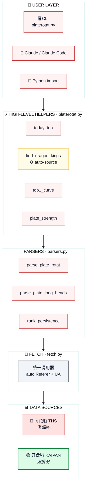

<div align="center">

# 📈 plate-rotation

### A 股板块轮动分析师 · Claude Code Skill

**双源对照 · 妖王识别 · 转折信号 · 终端风格**

[](https://docs.claude.com/en/docs/claude-code/overview)
[](https://www.python.org/)
[](https://docs.python.org/3/library/)
[](LICENSE)
[](#)
[](#)

</div>

```text
╔══════════════════════════════════════════════════════════════════╗
║   PLATE ROTATION TERMINAL  ·  双源对照  ·  v1.0                  ║
╠══════════════════════════════════════════════════════════════════╣
║                                                                  ║
║   [+] 算力        +5.23%   ████████░░   ▲  LEAD     · 真主线    ║
║   [+] F5G概念     +3.87%   ██████░░░░   ▲  HOT      · 妖板      ║
║   [-] 光纤        -1.42%   ███░░░░░░░   ▼  COLD     · 退潮      ║
║   [+] 通信        +2.15%   █████░░░░░   ▲  ACTIVE   · 接棒      ║
║   [-] 芯片        -0.83%   ████░░░░░░   ▼  FADING   · 让位      ║
║                                                                  ║
║   SRC: 同花顺(THS) × 开盘啦(KAIPAN)  ·  CROSS-VALIDATED          ║
╚══════════════════════════════════════════════════════════════════╝
```

> **一行命令出结论** — 把 4 个公开行情接口封装成 4 个高级 helper + 1 个 CLI, 配套一个**顶尖板块轮动分析师人格** (龙虎榜游资盘感 + 学院派结构框架双视角), 让 Claude / Claude Code 加载后用自然语言就能完成"今日 Top / 妖王榜 / 排名变化 / 板块强度"四件套。

---

## ✦ Capabilities · 能力四件套

<table align="center">
<tr>
<td align="center" width="25%">

### 📊 今日 Top N
**`today_top()`**

双源对照排行榜<br>
THS 涨幅% / KAIPAN 强度

🔴 **看赛道当下**

</td>
<td align="center" width="25%">

### 🐉 妖王榜
**`find_dragon_kings()`**

跨 N 天龙头持续性<br>
找真核心 / 接力 / 妖股

🔴 **找真核心**

</td>
<td align="center" width="25%">

### 📈 排名曲线
**`top1_curve()`**

Top5 板块 N 日轨迹<br>
看赛道切换断点

🟡 **抓转折信号**

</td>
<td align="center" width="25%">

### 💪 板块强度
**`plate_strength()`**

单板块强度+量能时序<br>
ECharts 数据流

🟢 **看板块健康**

</td>
</tr>
</table>

```text
─── 方法论核心 ─────────────────────────────────────────────────────
  KAIPAN  →  "这条赛道还在不在跑"   (强度分 = 持续性)
  THS     →  "今天谁在爆发"          (涨幅% = 当日资金集中度)
  双源同时上榜 = 真主线  ·  仅 KAIPAN = 退潮中  ·  仅 THS = 偶发热点
─────────────────────────────────────────────────────────────────────
```

加载到 Claude / Claude Code 后, 直接用自然语言就能调度上面四件套:

> 「今天最强板块前 10」<br>
> 「算力板块这 20 天谁是真龙头?」<br>
> 「Top5 板块这 20 天的排名变化趋势」<br>
> 「通信和芯片现在谁在接棒?」

---

## ⚡ Quick Start · 60 秒上手

### ◉ Step 1 — Install

```bash
# ── 方式 A · 推荐 ── npx skills (兼容 40+ AI agent) ────────────
npx skills add hssqz/plate-rotation-skill

# ── 方式 B ── 直接 clone 到 Claude skills 目录 ─────────────────
git clone https://github.com/hssqz/plate-rotation-skill.git \
  ~/.claude/skills/plate-rotation
```

> 💡 `npx skills add` 由 [vercel-labs/skills](https://github.com/vercel-labs/skills) 提供 — 它把任何含 root `SKILL.md` 的 GitHub repo 视作合法 skill 源, 落到 `~/.claude/skills/` (全局) 或项目 `.claude/skills/` (本地), 并可符号链接共享给 Claude Code / Cursor / Codex / Gemini CLI 等 agent。
>
> 全局安装: `npx skills add hssqz/plate-rotation-skill -g -a claude-code -y`

### ◉ Step 2 — Verify

```bash
python3 ~/.claude/skills/plate-rotation/scripts/platerotat.py today --n 5
```

看到类似下方的当日 Top5 板块表格即安装成功:

```text
┌───────┬──────────────────┬─────────┬──────────────┐
│  RANK │  CODE   NAME     │  VALUE  │  TYPE        │
├───────┼──────────────────┼─────────┼──────────────┤
│   #1  │  801807 算力     │  87.42  │  strength    │
│   #2  │  801660 通信     │  76.31  │  strength    │
│   #3  │  886084 F5G概念  │  68.55  │  strength    │
│   #4  │  803023 AI 应用  │  61.20  │  strength    │
│   #5  │  885998 光纤     │  54.83  │  strength    │
└───────┴──────────────────┴─────────┴──────────────┘
```

### ◉ Step 3 — Talk to Claude

打开 Claude Code, 直接问:

> 「**今天最强板块前 10**」<br>
> 「**算力这 20 天谁是真龙头?**」

skill 会自动加载, 分析师人格立即上岗。

### ◉ 依赖

| 项 | 要求 | 说明 |
|---|---|---|
| 🐍 Python | `3.9+` | 用了 PEP 585 类型语法 (`dict[str]` / `list[dict]`) |
| 📦 第三方包 | **无** | stdlib only, 不需要 `pip install` |
| 🌐 网络 | 公网直连 | 国内无需特殊配置, 后端只校验 Referer (已自动注入) |

---

## 🎯 触发关键词 · Trigger Keywords

skill 会在 Claude / Claude Code 检测到下列关键词时**自动加载**:

<div align="center">


</div>

> 也可以**显式调用**: 直接在对话里说 `用 plate-rotation skill 看看 ...`

---

## 🖥️ CLI · 命令速查

```bash
SKILL=~/.claude/skills/plate-rotation
PR=$SKILL/scripts/platerotat.py

# ─── ① 今日 Top10 板块 ───────────────────────────────────
python3 $PR today                       # 默认 KAIPAN (强度分)
python3 $PR today --source ths --n 10   # 切 THS 看当日涨幅%
python3 $PR today --json                # 输出原始 JSON

# ─── ② 板块妖王榜 (跨天龙头持续性) ───────────────────────
python3 $PR wangking 886084             # F5G  (88x → 自动 THS)
python3 $PR wangking 801807 --days 30   # 算力 (80x → 自动 KAIPAN)

# ─── ③ Top5 板块 N 日排名变化 ────────────────────────────
python3 $PR curve --source kaipan --days 20
python3 $PR curve --source ths    --days 30 --json

# ─── ④ 单板块强度+量能时序 ───────────────────────────────
python3 $PR strength 886084 --json      # ECharts JSON, 喂给前端
python3 $PR strength 801807 --days 30
```

<div align="center">

| Flag | 取值 | 说明 |
|---|---|---|
| `--days` | `10` / `20` / `30` / `50` | 时间窗口长度 |
| `--source` | `ths` / `kaipan` | 数据源 (today / curve 适用) |
| `--n` | `int` | Top N (today 适用) |
| `--json` | flag | 输出原始 JSON, 便于管道喂给 `jq` / Python |

</div>

> 💡 **板块代码强语义** — `88x` = 同花顺板块, `80x` / `803x` = 开盘啦板块, `wangking` 子命令会自动判, 用户**不需要**记这层映射。

---

## 📊 终端输出示例 · Terminal Output

> ⚠️ 以下为**示例数据** (illustrative), 用于展示输出风格。真实接口数据每日不同。

### ① CLI 原生输出

```text
$ python3 platerotat.py today --source kaipan --n 8
═══════════════════════════════════════════════════════════════════
  TODAY · KAIPAN STRENGTH RANKING                     8 sectors
═══════════════════════════════════════════════════════════════════
  #1   801807  算力          ▲  87.42   ████████░░   LEAD
  #2   801660  通信          ▲  76.31   ███████░░░   ACTIVE
  #3   886084  F5G概念       ▲  68.55   ██████░░░░   HOT
  #4   803023  AI 应用       ▲  61.20   █████░░░░░   ACTIVE
  #5   885998  光纤          ▲  54.83   █████░░░░░   ACTIVE
  #6   801580  机器人        ▼  42.10   ████░░░░░░   FADING
  #7   886037  减速器        ▲  39.85   ███░░░░░░░   COLD
  #8   885502  芯片          ▼  31.20   ███░░░░░░░   COLD
═══════════════════════════════════════════════════════════════════
```

### ② Claude 分析师人格叙述

> 你: 「今天最强板块前 8, 给我看下双源对照, 找妖板」

<table>
<tr><td>

**🧠 plate-rotation 分析师**

**事实层** (KAIPAN 强度 ⊕ THS 涨幅% 双源对照)

| 板块 | KAIPAN | THS | 形态 |
|---|---|---|---|
| 🔴 算力 (801807) | `#1` | `+5.23%` | ✓ 真主线 |
| 🔴 通信 (801660) | `#2` | `+2.15%` | ✓ 接棒 |
| 🔴 F5G (886084) | `#3` | `+3.87%` | ⚡ 妖板 |
| 🟢 芯片 (885502) | `#8` | `-0.83%` | ✗ 让位 |

**关键转折信号**

- 🔴 **算力**连续 13 天稳居 Top3, 今日 #1 — 主线**没断**
- ⚡ **F5G** 过去 10 天 7 天未上榜, 今日突然 #3 + 涨幅榜 #2 — **典型妖板形态** (一致性预期 + 流动性溢价)
- 🟢 **芯片**从昨天 #4 掉到 #8, 资金切换信号弹 — 留意是否承接到通信
- 🔴 通信 #2 + F5G #3 + 光纤 #5 三层产业链共振, **健康轮动**

**一句话总结**: 今天的真相是 — **算力主线还在跑, 通信接棒, F5G 是细分妖板, 芯片让位**。

**下一步建议**:
```bash
python3 platerotat.py wangking 801807   # 看算力龙头持续性
python3 platerotat.py strength 886084   # 看 F5G 量能健康度
```

</td></tr>
</table>

---

## 🐍 Python API

```python
import sys
sys.path.insert(0, '/path/to/plate-rotation/scripts')

from platerotat import (
    today_top,            # 今日 Top N        (源: getPlateRotatData)
    find_dragon_kings,    # 妖王榜            (跨天龙头持续性, 自动判 source)
    top1_curve,           # Top5 板块排名曲线 (源: getPlateRotatChart)
    plate_strength,       # 单板块强度+量能    (源: getPlateDayChart)
)

today_top(source='kaipan', n=10)                          # → list[dict]
find_dragon_kings(platecode='801807', days=20, top_n=10)  # → dict
top1_curve(source='kaipan', days=20)                      # → ECharts data
plate_strength(platecode='886084', days=20)               # → ECharts data
```

<details>
<summary>📦 <b>完整签名 & 返回结构</b> (点击展开)</summary>

```python
# ─── ① today_top ────────────────────────────────────────────
def today_top(
    source: str = 'kaipan',   # 'kaipan' | 'ths'
    n: int = 10,
    days: int = 20,
) -> list[dict]:
    """
    返回: [{'rank': 1, 'code': '801807', 'name': '算力',
            'value': '87.42', 'value_type': 'strength', ...}, ...]
    """

# ─── ② find_dragon_kings ────────────────────────────────────
def find_dragon_kings(
    platecode: str,           # 88x → 自动 ths / 80x → 自动 kaipan
    days: int = 20,
    top_n: int = 10,
) -> dict:
    """
    返回: {'platecode': '801807',
           'kings': [{'code': '...', 'name': '...',
                      'count': 6, 'positions': [...]}, ...]}
    """

# ─── ③ top1_curve ───────────────────────────────────────────
def top1_curve(
    source: str = 'kaipan',
    days: int = 20,
) -> dict:
    """
    返回: {'top5_names': [...], 'dates': [...],
           'series': [{'name': ..., 'data': [...]}, ...]}
    注意: data[i] = 10.5 + symbol=wu.png 表示当日未上榜
    """

# ─── ④ plate_strength ───────────────────────────────────────
def plate_strength(
    platecode: str,
    days: int = 20,
) -> dict:
    """
    返回: {'platecode': '886084', 'dates': [...],
           'strength': [...], 'volume': [...]}
    """
```

</details>

> 💡 **`find_dragon_kings` 自动判源** — 用户不需要记 "88x 走 ths / 80x 走 kaipan", 函数内部根据 `platecode` 前缀自动选 source。这是消除特殊情况的"好品味"实践。

---

## 🏗️ 架构数据流 · Architecture



```text
─── 4 个底层接口 ─────────────────────────────────────────────────
  /api/getPlateRotatData    今日 Top N + first 字段 (当日 Top1 板块)
  /api/getPlateRotatChart   Top5 N 日排名曲线 (ECharts)
  /api/getLongByPlate       单板块龙头矩阵 (HTML in JSON, td 序列)
  /api/getPlateDayChart     单板块强度+量能 (ECharts, legend=null=未活跃)
─────────────────────────────────────────────────────────────────
```

> 🎯 **设计原则**: Reference-first / 三层 API 分级 / Stdlib only / 裸调即可 (无需 cookie)。详见 [`CLAUDE.md`](CLAUDE.md) 模块地图。

---

## 📁 项目结构 · Layout

```text
plate-rotation/
├── 📜 SKILL.md            ← Claude 加载入口 (人格 + 方法论 + 工具弹药)
├── 📐 CLAUDE.md           ← L2 模块地图 (GEB 文档协议)
├── 📖 README.md           ← 本文件 · GitHub 访客导览
├── ⚖️  DISCLAIMER.md       ← 数据使用免责 + 不构成投资建议
├── 📄 LICENSE             ← MIT
│
├── 📚 references/         ← 4 接口规格 + 路由总表
│   ├── _INDEX.md                        ← 双源差异 + 板块代码前缀语义
│   ├── api_getplaterotatdata.md         ← ① 主表 (HTML in JSON)
│   ├── api_getplaterotatchart.md        ← ② Top5 N 日 ECharts
│   ├── api_getlongbyplate.md            ← ③ 单板块龙头矩阵
│   └── api_getplatedaychart.md          ← ④ 单板块强度+量能
│
├── 🛠️  scripts/            ← stdlib only, 无第三方依赖
│   ├── fetch.py                         ← 统一调用器 (3 host alias)
│   ├── parsers.py                       ← 5 个 HTML→dict 解析器
│   └── platerotat.py                    ← 4 helper + CLI 入口
│
└── 🧪 tests/              ← 在线集成测试 (stdlib unittest)
    ├── __init__.py
    └── test_plate_rotation.py           ← 5 TestCase × 31 用例
```

---

## 🧪 测试 · Tests

```bash
cd ~/.claude/skills/plate-rotation
python3 -m unittest tests.test_plate_rotation -v
```

走**真实在线接口**验证, 5 个 TestCase 共 **31 个用例**:

| TestCase | 覆盖范围 | 用例数 |
|---|---|---|
| `TestFetchEndpoints` | 4 个底层 endpoint 健康度 | 4 |
| `TestParsers` | 5 个 parsers helper 在真实 HTML in JSON 上的解析正确性 | 9 |
| `TestHighLevelHelpers` | 4 个高级 helper 签名 + 返回结构 | 8 |
| `TestSourceAutoPick` | 88x→ths / 80x→kaipan 自动路由 | 4 |
| `TestCLI` | 4 子命令 × text+json 双模 + 错误路径 | 6 |

> 💡 共享 `_Fixtures._cache` 跨 TestCase 缓存接口响应, 整套跑下来对上游接口的请求次数最小化。

---

## ⚠️ DISCLAIMER · 重要声明

```text
╔══════════════════════════════════════════════════════════════════╗
║  ⚠  RISK NOTICE  ·  请仔细阅读                                   ║
╠══════════════════════════════════════════════════════════════════╣
║                                                                  ║
║  ▸ 数据来源: 第三方公开市场行情接口                              ║
║    接口稳定性由上游决定, 不做任何承诺                            ║
║                                                                  ║
║  ▸ 用途定位: 仅供复盘与量化研究                                  ║
║    本工具不构成任何投资建议                                      ║
║                                                                  ║
║  ▸ 责任归属: 用户基于本工具做出的交易决策                        ║
║    由用户自行承担盈亏责任                                        ║
║                                                                  ║
║  ▸ 合规底线: 不绕过任何加密接口 / 不做高频压测 / 不反爬          ║
║                                                                  ║
╚══════════════════════════════════════════════════════════════════╝
```

完整声明详见 [`DISCLAIMER.md`](DISCLAIMER.md)。

---

## License & Contributing

<table>
<tr>
<td width="50%" valign="top">

### 📄 License

[MIT](LICENSE) © 2026 [@hssqz1998](https://github.com/hssqz)

可商用 · 可修改 · 可再分发<br>
保留版权与许可证声明即可。

</td>
<td width="50%" valign="top">

### 🤝 Contributing

**欢迎提 issue / PR**:
- 接口失效 / 数据异常 → 附 `fetch.py -v` 输出
- 新增分析维度 → 先在 issue 讨论范围
- 文档/typo → 直接 PR

**不接受**:
- 任何引入第三方依赖的改动 (stdlib only 原则)
- 加密接口逆向 / 高频压测 / 反爬绕过

</td>
</tr>
</table>

---

<div align="center">

**Made with 🔴 + 🟢 by [@hssqz1998](https://github.com/hssqz1998)**

```text
─────  双源对照 · 妖王识别 · 转折信号  ─────
  the map IS the terrain · GEB protocol
─────────────────────────────────────────────
```

[](https://github.com/hssqz/plate-rotation-skill)
[](https://github.com/hssqz/plate-rotation-skill/issues)
[](https://github.com/hssqz/plate-rotation-skill/commits)

</div>
